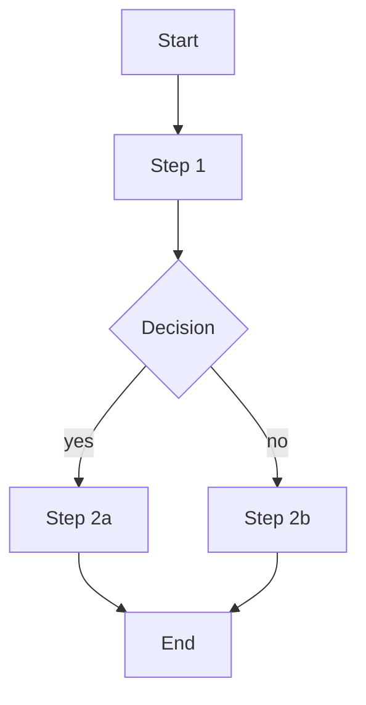

<!--
  Default template — แก้ per-project ได้โดย copy ไป `templates/flow.md` (lookup priority สูงกว่า)
-->

---
tags: [type/flow]
status: draft
date: <YYYY-MM-DD>
related_features: []
related_functions: []
---

# Flow — <Flow name>

## 1. Purpose

<user ได้อะไรจาก flow นี้>

## 2. Actors

- Primary: <persona>
- Secondary: <ถ้ามี>

## 3. Pre-conditions

- <สถานะที่ต้องมีก่อนเริ่ม>

## 4. Steps

1. <step 1 — link ไป [[FN-<area>-<slug>]]>
2. <step 2>

## 5. Post-conditions / Success

- <สถานะหลังสำเร็จ>

## 6. Error paths

- <error 1> → <recovery>

## 7. Variations

- <variation ตาม role / context>
